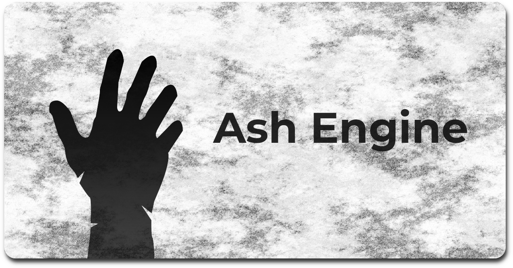

<h1 align="center">⚠️ Currently Unusable in Very Early Production</h1>

<h1 align="center">Ash Engine</h1>

[-f7a41d?logo=zig&logoColor=f7a41d&label=Zig)](https://ziglang.org/download/)

## 3D cross-platform game engine

**Ash is a Clustered Forward+, ECS based, Cross-Platform, Language Interoperable, Performance Oriented, Moddable 3D Engine**
